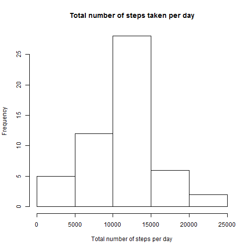
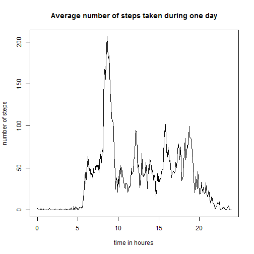
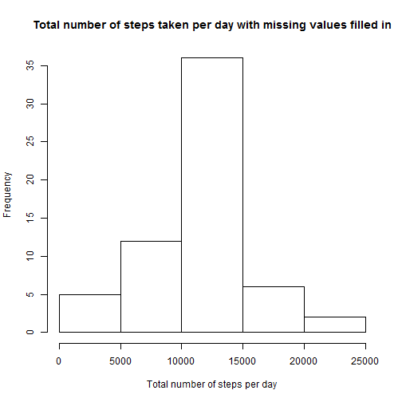
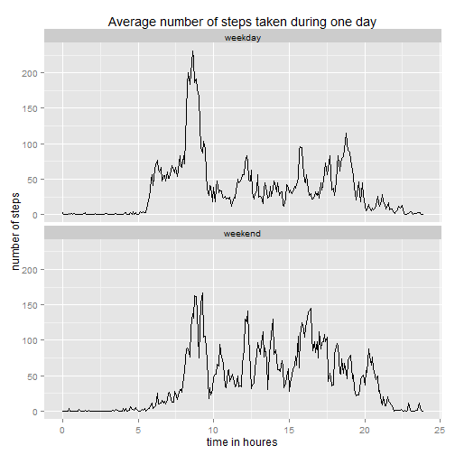

# Reproducible Research: Assignment 1

##Loading and preprocessing the data

The data is read in. Here are the first ten rows of the data as well as the structure and a summary of the data:

```r
data<-read.csv("activity.csv")
head(data,10)
```

```
##    steps       date interval
## 1     NA 2012-10-01        0
## 2     NA 2012-10-01        5
## 3     NA 2012-10-01       10
## 4     NA 2012-10-01       15
## 5     NA 2012-10-01       20
## 6     NA 2012-10-01       25
## 7     NA 2012-10-01       30
## 8     NA 2012-10-01       35
## 9     NA 2012-10-01       40
## 10    NA 2012-10-01       45
```

```r
str(data)
```

```
## 'data.frame':	17568 obs. of  3 variables:
##  $ steps   : int  NA NA NA NA NA NA NA NA NA NA ...
##  $ date    : Factor w/ 61 levels "2012-10-01","2012-10-02",..: 1 1 1 1 1 1 1 1 1 1 ...
##  $ interval: int  0 5 10 15 20 25 30 35 40 45 ...
```

```r
summary(data)
```

```
##      steps                date          interval     
##  Min.   :  0.00   2012-10-01:  288   Min.   :   0.0  
##  1st Qu.:  0.00   2012-10-02:  288   1st Qu.: 588.8  
##  Median :  0.00   2012-10-03:  288   Median :1177.5  
##  Mean   : 37.38   2012-10-04:  288   Mean   :1177.5  
##  3rd Qu.: 12.00   2012-10-05:  288   3rd Qu.:1766.2  
##  Max.   :806.00   2012-10-06:  288   Max.   :2355.0  
##  NA's   :2304     (Other)   :15840
```

The packages dplyr and ggplot2 will be needed.


```r
library(dplyr)
library(ggplot2)
```

```
## Warning: package 'ggplot2' was built under R version 3.1.2
```

As the column date is a factor variable, it is converted to a Date variable. Also the column interval indentifying the 5-minute interval in which the measurement was taken is an integer variable with for example 1655 meaning the time 4:55 pm. This is not suitable for further analysis and charts. Therefore another column is added showing the total minutes.


```r
data$date <- as.Date(data$date)
data<-mutate(data, minutes=floor(data$interval/100)*60+data$interval%%100)
```

Here is the structure and summary of the data after transforming it as decribed:

```r
str(data)
```

```
## 'data.frame':	17568 obs. of  4 variables:
##  $ steps   : int  NA NA NA NA NA NA NA NA NA NA ...
##  $ date    : Date, format: "2012-10-01" "2012-10-01" ...
##  $ interval: int  0 5 10 15 20 25 30 35 40 45 ...
##  $ minutes : num  0 5 10 15 20 25 30 35 40 45 ...
```

```r
summary(data)
```

```
##      steps             date               interval         minutes      
##  Min.   :  0.00   Min.   :2012-10-01   Min.   :   0.0   Min.   :   0.0  
##  1st Qu.:  0.00   1st Qu.:2012-10-16   1st Qu.: 588.8   1st Qu.: 358.8  
##  Median :  0.00   Median :2012-10-31   Median :1177.5   Median : 717.5  
##  Mean   : 37.38   Mean   :2012-10-31   Mean   :1177.5   Mean   : 717.5  
##  3rd Qu.: 12.00   3rd Qu.:2012-11-15   3rd Qu.:1766.2   3rd Qu.:1076.2  
##  Max.   :806.00   Max.   :2012-11-30   Max.   :2355.0   Max.   :1435.0  
##  NA's   :2304
```


## What is the mean total number of steps taken per day?

### Total number of steps taken per day

```r
steps_per_day <- data %>% group_by(date) %>% summarize(total_steps=sum(steps))
steps_per_day
```

```
## Source: local data frame [61 x 2]
## 
##          date total_steps
## 1  2012-10-01          NA
## 2  2012-10-02         126
## 3  2012-10-03       11352
## 4  2012-10-04       12116
## 5  2012-10-05       13294
## 6  2012-10-06       15420
## 7  2012-10-07       11015
## 8  2012-10-08          NA
## 9  2012-10-09       12811
## 10 2012-10-10        9900
## 11 2012-10-11       10304
## 12 2012-10-12       17382
## 13 2012-10-13       12426
## 14 2012-10-14       15098
## 15 2012-10-15       10139
## 16 2012-10-16       15084
## 17 2012-10-17       13452
## 18 2012-10-18       10056
## 19 2012-10-19       11829
## 20 2012-10-20       10395
## 21 2012-10-21        8821
## 22 2012-10-22       13460
## 23 2012-10-23        8918
## 24 2012-10-24        8355
## 25 2012-10-25        2492
## 26 2012-10-26        6778
## 27 2012-10-27       10119
## 28 2012-10-28       11458
## 29 2012-10-29        5018
## 30 2012-10-30        9819
## 31 2012-10-31       15414
## 32 2012-11-01          NA
## 33 2012-11-02       10600
## 34 2012-11-03       10571
## 35 2012-11-04          NA
## 36 2012-11-05       10439
## 37 2012-11-06        8334
## 38 2012-11-07       12883
## 39 2012-11-08        3219
## 40 2012-11-09          NA
## 41 2012-11-10          NA
## 42 2012-11-11       12608
## 43 2012-11-12       10765
## 44 2012-11-13        7336
## 45 2012-11-14          NA
## 46 2012-11-15          41
## 47 2012-11-16        5441
## 48 2012-11-17       14339
## 49 2012-11-18       15110
## 50 2012-11-19        8841
## 51 2012-11-20        4472
## 52 2012-11-21       12787
## 53 2012-11-22       20427
## 54 2012-11-23       21194
## 55 2012-11-24       14478
## 56 2012-11-25       11834
## 57 2012-11-26       11162
## 58 2012-11-27       13646
## 59 2012-11-28       10183
## 60 2012-11-29        7047
## 61 2012-11-30          NA
```

```r
summary(steps_per_day$total_steps)
```

```
##    Min. 1st Qu.  Median    Mean 3rd Qu.    Max.    NA's 
##      41    8841   10760   10770   13290   21190       8
```

### Histogram of the total number of steps taken each day


```r
hist(steps_per_day$total_steps,xlab="Total number of steps per day", main="Total number of steps taken per day")
```

 

### The mean and median of the total number of steps taken per day


```r
total_steps_mean <- mean(steps_per_day$total_steps,na.rm=TRUE)
total_steps_median <- median(steps_per_day$total_steps,na.rm=TRUE)
```
The mean of the total steps taken per day is 1.0766189 &times; 10<sup>4</sup>, the median is 
10765.

## What is the average daily activity pattern?

The following time series plot shows the average number of steps taken per 5-minute interval, averaged across all days.


```r
steps_per_interval <- data %>% group_by(minutes) %>% summarize(avg_steps_interval=mean(steps,na.rm=TRUE))
plot(steps_per_interval$minutes/60,steps_per_interval$avg_steps_interval,type='l',xlab='time in houres',ylab='number of steps',main='Average number of steps taken during one day')
```

 


```r
max_ind<-steps_per_interval$minutes[which.max(steps_per_interval$avg_steps_interval)]
max_ind_time <- paste0(floor(max_ind/60),":",max_ind%%60)
```
The maximum number of steps averaged across all days are taken in the interval 515 (in minutes) corresponding to time 8:35.

## Imputing missing values


```r
steps_missing <- sum(is.na(data$steps))
```

There are 2304 missing values. 

These missing values are filled with the mean of the corresponding 5-minute interval. A new data set, data_new, is created with the missing data filled in.


```r
data2 <- merge(data,steps_per_interval,by.x="minutes",by.y="minutes")
missing <- is.na(data2$steps)
data2$steps[missing] <- data2$avg_steps_interval[missing]
data_new <- data2[,c("steps","date","interval","minutes")]
```

```r
steps_per_day_new <- data_new %>% group_by(date) %>% summarize(total_steps=sum(steps))
hist(steps_per_day_new$total_steps,xlab="Total number of steps per day", main="Total number of steps taken per day with missing values filled in")
```

 

```r
total_steps_mean_new <- mean(steps_per_day_new$total_steps,na.rm=TRUE)
total_steps_median_new <- median(steps_per_day_new$total_steps,na.rm=TRUE)
```
The new mean of the total steps taken per day with the missing values filled in is 1.0766189 &times; 10<sup>4</sup>, the median is 1.0766189 &times; 10<sup>4</sup>, which means that the mean and median are identical whereas they were slightly different when missing values were not filled in

## Are there differences in activity patterns between weekdays and weekends?


```r
# note: Samstag is German for Saturday
data_new <- mutate(data_new,ind_weekday=ifelse(weekdays(data_new$date)>="Samstag","weekend","weekday"))
head(data_new)
```

```
##      steps       date interval minutes ind_weekday
## 1 1.716981 2012-10-01        0       0     weekday
## 2 0.000000 2012-11-23        0       0     weekday
## 3 0.000000 2012-10-28        0       0     weekend
## 4 0.000000 2012-11-06        0       0     weekday
## 5 0.000000 2012-11-24        0       0     weekend
## 6 0.000000 2012-11-15        0       0     weekday
```

```r
steps_per_interval_weekday <- data_new %>% group_by(minutes,ind_weekday) %>% summarize(avg_steps=mean(steps)) 
g <- ggplot(steps_per_interval_weekday,aes(minutes/60,avg_steps)) + geom_line()+facet_wrap(~ind_weekday,nrow=2)+labs(title="Average number of steps taken during one day",x="time in houres",y="number of steps")
print(g)
```

 
